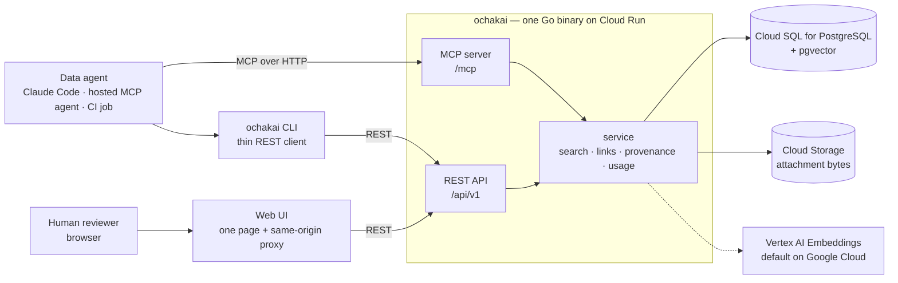

# Architecture

This page is a summary. The decisions it describes are recorded in the
numbered decision records under [docs/design](design) — mostly in
Japanese, and authoritative where this page and they disagree. Start from
[the index](design/README.md): it groups every record by area and marks
which ones still describe the current state, and
[README.en.md](design/README.en.md) beside it summarizes each record in
English. Sections below cite the
record they rest on as `(design doc NNNN)`, the way the
[README](../README.md) does.

## What it is

ochakai is one Go binary in front of a PostgreSQL database. It stores
knowledge concepts — metric definitions, verified golden queries,
interpretation notes, glossary terms, table catalog entries — and serves
them to data agents over MCP, a REST API, a CLI, and a bundled web UI.
Every concept carries who wrote it, who verified it, and when.

Two refusals shape everything else (design doc
[0001](design/0001-architecture.md)):

- **No LLM.** Nothing in the request path summarizes, rewrites, or
  interprets. What comes back is what a human or an agent wrote and a
  human verified. Embeddings are the one exception in spirit and not in
  fact: an encoder is deterministic and produces no text.
- **No SQL execution.** ochakai holds no warehouse credentials and has no
  way to reach your data. It returns the query; your agent runs it.

It also has no connector ingestion, no user database, and no
authorization system. The last of those is not an omission — see below.

The supported runtime is Google Cloud: Cloud Run for the process, Cloud
SQL for the database, and Vertex AI for embeddings — which is on by
default there rather than optional (design docs
[0003](design/0003-gcp-only.md),
[0053](design/0053-embeddings-by-default.md)). That decision superseded an earlier
"runs anywhere" position, and it was made for a reason worth knowing
before you adopt: the identity model — no tokens, no passwords, no
secrets — is built entirely on Google Cloud's IAM, and keeping a non-GCP
path alive meant keeping a second authentication path alive with it.
Portability is promised for the *data*, not the runtime: the knowledge
base round-trips through OKF bundles, which are plain markdown in git.
Local development runs against a plain PostgreSQL in Docker.

## Component layout



`serve` runs the MCP server and the REST API on one port, next to the
database. The CLI and the web UI are REST clients and hold no database
connection of their own (design doc
[0007](design/0007-api-only-cli.md)); the web UI is a single
self-contained page with no build step, served either from your loopback
by `ochakai ui` or as a team service by `ochakai serve-ui` — the same
container image, a different argument (design doc
[0006](design/0006-web-ui-serving.md)).

## Identity, provenance, and no authorization

**Whoever can reach the service can read and write it — there is no
per-concept permission, and for some organizations that is a hard stop.**
What that means operationally, and the postures that narrow it, are in
[requirements and configuration](configuration.md#authentication-has-no-configuration)
(design doc [0002](design/0002-authn-authz.md)); this section is the *why*.

What ochakai does with an identity is *record* it, for one purpose:
deciding whose name goes on the concept (how the identity itself is read
is in
[requirements and configuration](configuration.md#authentication-has-no-configuration)).
Verifying a concept is not restricted either: who verified it is always
recorded, so the decision about whether to trust it is made by whoever
reads the provenance, not by a gate at the write. The phrase the record
uses is that trust is secured *by recording, not by authorizing*.

The consequences to plan around:

- **The service must be private.** On a public Cloud Run service the
  identity headers are self-asserted and the whole model collapses. IAM
  enforcement is the security boundary; the [operating
  guide](guides/operating.md#hardening) carries a hardening checklist.
- **An embedding application collapses its users into one identity.** An
  app that calls ochakai with its own service account records every one
  of its users as that service account.
  [Delegated provenance](guides/rest-integration.md#delegated-provenance-forwarding-who-used-your-product)
  fixes this for callers an operator lists explicitly (design doc
  [0027](design/0027-delegated-provenance.md)); the team web UI does the
  same from an IAP-signed JWT (design doc
  [0032](design/0032-webui-iap-identity.md)).
- **The identity says who, not what.** An agent that writes under a
  person's own credentials — an MCP client, a CLI in a script — records
  that person, and the record then reads as if they wrote the prose.
  `X-Ochakai-Producer: insightflow/1.4.0` (or, on MCP, the client's
  `initialize` info) names the software; it is recorded beside the actor
  and never in place of it, because it is the one thing here the caller
  declares about itself rather than something authentication observed
  (design doc [0052](design/0052-producer-beside-the-actor.md)).
- **Provenance is never read from a payload.** Import puts nothing from a
  bundle's frontmatter into a ledger, and nothing there moves the trust
  tier. Provenance is what this instance observed, not what a document
  claims about itself (design docs
  [0009](design/0009-provenance-portability.md),
  [0035](design/0035-verifiability.md)). What the document does claim is
  kept, plainly labelled as a claim, rather than thrown away — see the
  data model below.

A deployment can be made **read-only**, which is not authorization
either and for a sharper reason: the check never looks at the caller, so
it refuses whoever operates the deployment exactly as it refuses anyone
else. It sits in the service layer that both REST and MCP pass through,
so a write endpoint added later is covered without its author knowing
about it. What each surface does about it, and the sibling **public**
posture that also stops reading identity at all, are in
[requirements and configuration](configuration.md#environment-variables)
(design docs [0040](design/0040-read-only-mode.md),
[0042](design/0042-public-read-only.md)).

There is one narrow exception to "no authorization", and it is
deliberately framed as not being one: MCP refuses to overwrite, delete,
or change a concept a human has ruled on — verified, rejected, or
deprecated — and refuses to revive such a concept's
soft-deleted tombstone with a create. The reasoning is visibility rather
than permission: a silently replaced verified golden query is discovered
only when somebody runs it and gets a wrong number, and MCP has no
conditional-write channel (no ETag) with which an agent could state what
it believed it was replacing. The human surfaces are unrestricted
(design doc [0015](design/0015-surface-consistency.md) §3.1).

## The data model

**A concept is an [OKF](https://github.com/GoogleCloudPlatform/knowledge-catalog/tree/main/okf)
v0.2 document** — YAML frontmatter, then a markdown body — and that is
the stored form, the wire form, and the export form alike (design doc
[0046](design/0046-bundle-address-space.md) §2.2, which carries design
doc 0043's *the document is the only truth* forward and takes it down to
the byte level: what a write stores is the bytes it received, and the
canonical form is derived from them). Reading a concept, editing it, and
sending it back is one loop with no translation in it — the id is the
address, at both ends:

```sh
curl -X PUT http://localhost:8080/api/v1/bundle/metrics/revenue.md \
  -H 'content-type: text/markdown' \
  --data-binary $'---\ntype: Metric\n---\n\nCompleted orders only, net of refunds.\n'
```

The database columns beside the document are an index derived from it,
used to sort and filter; where the two could disagree the document is
right. Keys OKF does not define are kept exactly where their writer put
them, at the top level and inside a `sources` entry, a parameter, the
executor or the attester, because a key discarded on the way in is a key
no later release can recover.

A concept's version is the hash of the document as stored, which a read
returns as an `ETag` and a write takes back as `If-Match`. Being a hash
of the document alone, confirming a concept, rejecting it or attaching a
file to it all leave a held precondition valid; reformatting the concept
moves it, because the file did change — what the concept *says* did not,
and that is what `generated.at` reports.

**Types are an open set with a recommended vocabulary.**

| Type | What it holds |
|---|---|
| `Metric` | Semantic metric definition, synonyms |
| `Attested Computation` | A sanctioned computation and the means to check a run of it: the computation in a `# Computation` body fence, the contract in the `runtime` / `parameters` / `executor` / `attester` fields. ochakai records it and never runs it. A golden query is one of these: `runtime` says where the SQL runs, and a producer key such as `question` carries the question it answers |
| `Skill` | A procedure a concept's `executor.resource` points at — how to actually run a computation on a given runtime |
| `Insight` | How to read a metric: baselines, seasonality, caveats, thresholds |
| `Policy` | The rule that decides a number — revenue recognition, cost allocation. What a concept's `sources[].resource` cites |
| `Glossary Term` | Glossary term |
| `BigQuery Dataset` | BigQuery dataset catalog entry: a container grouping tables |
| `BigQuery Table` | BigQuery table catalog entry: source, column notes, known issues |
| `Reference` | Mirror of external material: enum definitions, licenses, schema docs |

These are recommendations, not a closed set: any single-line string
works as a type for your own document kinds. The spellings are the OKF
knowledge-catalog vocabulary verbatim — `Attested Computation`, not a
slug — so a bundle's types survive a round-trip with no translation
layer in between, and what earns a place in the recommended nine is
SPEC §4.1's one demand of a producer — that the spelling be descriptive
and self-explanatory — read against the spellings OKF itself supplies,
in the spec's own examples and in its reference bundles (design docs
[0023](design/0023-okf-type-vocabulary.md),
[0038](design/0038-type-vocabulary-realignment.md)). Matching is
case-insensitive; the spelling you write is the one stored.

**Identity is a path.** A concept's id is its address and its bundle
location: `queries/sales/monthly-revenue` is one concept, and the
directories are how you organize a knowledge base — a type is an
attribute of a concept, not part of its address, so the layout of an
exported bundle comes from ids alone (design doc
[0017](design/0017-path-addressing.md)). MCP addresses a concept as a
resource by that path under the `ochakai://` scheme — a URI for MCP's
sake, which never travels in a bundle. `title` is optional — a concept
without one is displayed by the last segment of its id, the way a file
is named by its filename — and ids are NFC-normalized and searchable in
their own right (design doc [0022](design/0022-filename-as-name.md)).

Because the address is the path, the path is also something to search
within. `--prefix` (REST `?prefix=`, MCP `prefixes`) narrows a search or
a `context` call to a subtree, repeatable and OR-ed, so one call can
cover two parts of the tree and tell the answers apart by id (design doc
[0041](design/0041-path-scoped-search.md)). Matching is on segment
boundaries: `metrics` does not reach `metrics-legacy`. How much this
buys depends on what the directories mean —
[examples/demo](../examples/demo) groups by kind (`metrics/`,
`glossary/`, `queries/sales/`), where `--type` already does most of
this; it earns its keep when directories mean something `--type` cannot
say, such as one team's own vocabulary beside a shared one. ochakai
attaches no meaning to any path either way, and the filter is not an
access control: any caller may pass any prefix, and passing none returns
everything they could already reach.

**Relationships come from the prose.** There is no links field. A
markdown link in the body — `[revenue](/metrics/revenue.md)` or a
relative path (`./gross.md`) — those two are the forms OKF SPEC §6
defines, and they are the only ones — is the edge; the target gains a
backlink, and `get_context` expands the edge in both directions. What
kind of relationship it is comes from the sentence around it, so ochakai
stores no relationship vocabulary of its own (design doc
[0024](design/0024-links-from-body.md)). Links inside fenced code blocks
(``` or ~~~) and inline `` `code spans` `` are examples and are skipped
— indented code is not detected, so a link four spaces deep is read as
prose. Renaming a concept rewrites the references pointing at it, prose
included.

**Attachments** live beside a concept — the dashboard screenshot behind
an insight, the ER diagram behind a table concept, the seeds.txt or spec
PDF behind a dataset — and round-trip through OKF bundles as plain files
next to it. Accepted formats are the intersection of what Claude reads
and what Gemini embeds: PNG, JPEG, WebP, PDF, plain text, sniffed from
the bytes rather than trusted from a filename, because that operation is
one of the ones 0046 §3.5 folds into the bundle address, and the fold is
still landing. Bytes live in Cloud Storage and are fetched on demand,
one object up to 5 MiB, with the database keeping what addresses them
(design doc [0046](design/0046-bundle-address-space.md) §3.2, which
keeps design doc 0013's judgment); with `OCHAKAI_GCS_BUCKET` unset the
instance stores markdown concepts only and a non-markdown write is
refused. Attachments are searchable: filenames match in every search,
and contents join hybrid search wherever embeddings are enabled — text
with any embedding model, images and PDFs with `gemini-embedding-2` —
and a hit is always the owning concept, never the file itself (design
doc [0020](design/0020-attachment-search.md)).

**Trust travels with the knowledge.** OKF v0.2's schema is ochakai's
schema: every key the spec defines is a first-class field, so an
exported concept carries its provenance, trust and lifecycle (SPEC §5)
where a consumer that has never heard of ochakai will look for them.

```yaml
type: Attested Computation
runtime: bigquery
title: Monthly revenue by channel
sources:
  - id: rev-policy
    resource: https://wiki.example/finance/revenue-recognition
    title: Revenue Recognition Policy (FY2026)
    author: human:jsmith@example.co.jp
    last_modified: "2026-06-15"
usage_window: { from: "2026-06-01", to: "2026-06-30" }
generated: { by: process:analyst@example.iam.gserviceaccount.com, producer: insightflow/1.4.0, at: 2026-07-26T04:12:00Z }
verified:
  - { by: human:tanaka@example.co.jp, at: 2026-07-26T09:30:00Z }
status: stable                 # draft | stable | deprecated
stale_after: "2026-12-31"      # advisory: re-check on and after this day
```

`sources` is the material a concept derives from — give one an `id` and
a markdown footnote in the body can attribute a single claim to it.
`generated` is who the content stands by and when it last changed;
`verified` is who confirmed it — absent means unverified, and a
`human:` entry is what makes it human-reviewed (SPEC §5.3). ochakai
holds these the way the spec defines them: `status` is the lifecycle
value alone (`draft`, `stable`, `deprecated` — SPEC §5.4) and `verified`
is an append-only ledger of every confirmation, so the two signals stay
independent. A draft somebody checked and a stable concept nobody has
are both states the model can hold, and a foreign bundle's lifecycle
value survives the trip unaltered.

A rejection — reviewed and *not* accepted — is this instance's ruling
rather than a stage of the concept, so it is not a status either, and it
is the record most stores lack: an agent can check it before
re-proposing the same thing. It exports as `rejected_by` /
`rejected_at` beside the concept's real status, and import never reads
it back — a bundle carries knowledge, not one instance's judgments
(design doc [0046](design/0046-bundle-address-space.md) §2.4, which
inherits design doc 0043 §§3.2-3.3 unchanged).

ochakai **records** these; it never acts on them. It does not fetch a
source's `resource`, score its credibility signals, or run an Attested
Computation's `executor` and `attester` — weighing the signals and
running the computation belong to whoever consumes the concept (SPEC
§5.1, §10.5).

Every change is kept as a revision, and `delete` is a soft delete.
Discarding history is a second, explicit step — `purge`, available on
REST and the CLI only, which leaves an audit row behind and frees the id
(design doc [0031](design/0031-purge.md)).

## The four surfaces

REST, MCP, CLI, and the web UI are held to one rule: a feature lands on
all of them consistently, including where it deliberately lands on none
(design doc [0015](design/0015-surface-consistency.md)). Each has a
declared job.

| Surface | Job |
|---|---|
| REST `/api/v1` | The only contract. A feature lands here first or nowhere; limits, enums, and defaults live server-side. [api/openapi.yaml](../api/openapi.yaml) is the published wire surface |
| MCP `/mcp` | The agent's purpose-built entrance. Tool schemas cost the agent context, so the tool count is a budget — not a mirror of REST. `get_context` is the extreme case: one call returns everything the loop needs |
| CLI | The completeness surface. A pure REST client covering every operation, for humans and for agents with a shell |
| Web UI | The human half of the loop. Search, browse, review, history — a curation surface, not a BI tool. The page knows nothing about authentication, which is what lets one page ship two ways |

The value of writing the roles down is that it makes the omissions
reviewable. MCP carries no `browse` (walking a tree is multi-round-trip
exploration, the opposite of `get_context`), no `revisions` and no
`links_to` reverse lookup (duplicated or too heavy in tokens — an agent
that wants what points at a concept gets it inside `get_context`, which
follows the same edge), no attachment writes
(base64 in a tool argument wastes tokens, and an agent's write-back
should be searchable text), no bulk export or import, and no `verify` —
re-verification is a human judgment. The web UI carries no outcome
reporting, because a surface that cannot run SQL would produce
worked/failed reports with no action behind them. REST carries no SQL
execution, no LLM features, no user management, and no bulk OKF import.

That last one is the single place the CLI is more than a thin client.
Loading a bundle is a loop over endpoints that already exist, so a
server-side second path to the same outcome would buy convenience rather
than capability — at the cost of a second implementation to keep in sync.
The acknowledged price is that bundle semantics live in the client, and
the mitigation is that [api/openapi.yaml](../api/openapi.yaml) spells out
what the loop does, so another implementation can reproduce it. The
record names the condition that would reverse the decision: a restore
demanded from an environment where the binary cannot be run (design doc
[0015](design/0015-surface-consistency.md) §3.2).

## Storage

One database. Concepts, revisions, links, usage totals, and embedding
vectors all live in PostgreSQL — pgvector for the vectors, which Cloud
SQL and a plain Postgres both provide, so hybrid search adds no
infrastructure (design doc [0001](design/0001-architecture.md) §4).
There is no Redis, no separate vector database, and no search cluster.
Migrations ship in the binary. Non-markdown bytes are the exception —
they live in Cloud Storage instead, as covered under Attachments above.

Usage recording is deliberately off the read path: events are buffered in
memory and flushed periodically, statistics are documented as
best-effort, an overrun is dropped rather than backing up the request,
and shutdown drains before a final flush (design doc
[0029](design/0029-usage-recording-off-the-read-path.md)). Concurrent
edits are handled by optimistic locking on that same document hash
(design doc [0030](design/0030-optimistic-locking.md)).

## Search

Search has a lexical half and an optional vector half.

The lexical half exists in the shape it does because of Japanese.
PostgreSQL's full-text search does not tokenize it, so ochakai matches
query *fragments* against a stored haystack — id, title, description,
tags, body, attachment filenames. Latin tokens stay whole; a run of
Japanese, which has no spaces to split on, is cut into sliding
two-character windows, and only the windows carrying a kanji or katakana
are kept, since an all-hiragana window is grammar and matches nearly
everything. Concepts are ranked by how much of the *rare* part of a
query they contain — that finds the right concepts for a keyword and
for a Japanese question, but it is still a bag of words: ask an English
question and a concept sharing three of its function words can outrank
the one that names the subject.

The cost is known and written down: a trigram index cannot serve a
two-character pattern — there is no whole trigram inside one — so a
Japanese term like 売上 is answered by a table scan. Measured on 5000
concepts that is about 16 ms against 0.2 ms for an indexed Latin word.
Three-character windows would restore the index and lose exactly the
terms the search exists to find, so the scan is the price. It is fine at
the scale a curated knowledge base reaches, and it does not stay fine
forever.

The vector half — Vertex AI embeddings, authenticated by ADC with no API
key to hold, fused with the lexical ranking by reciprocal rank fusion —
is **on by default where ochakai runs on Google Cloud** (design doc
[0053](design/0053-embeddings-by-default.md); what decides it, and how to
decline, is in
[requirements and configuration](configuration.md#environment-variables)).
Vectors are written when a concept is written, so a base loaded before
embeddings were reachable — or a changed model — leaves older concepts
unembedded until `ochakai reembed` runs.

Scores are not calibrated and are not comparable between the two modes.
Treat them as an ordering. To bound what comes back, use the byte
budget rather than a score threshold: `get_context` returns full concepts
up to the budget and names the rest as outline rows, and `hits` carry a
ranking only — id, type, title, status, whether it is verified, score —
never a second copy of the knowledge (design doc
[0033](design/0033-context-hits-are-a-ranking.md)). Search hits are the
same kind of thing: a row names a concept and says what ranked it, and the
document is one fetch away by id (design doc
[0046](design/0046-bundle-address-space.md) §3.5).

## The write-back and verification loop

The bet in design doc [0001](design/0001-architecture.md) is that agents
supply the breadth and humans supply the judgment. An agent writes what
it learned as a `draft`; a human confirms it, promotes it to `stable`,
deprecates it, or rejects it with a reason. Provenance and revisions make
that reviewable after the fact.

What closes the loop is the machinery for noticing that verified
knowledge has stopped being true (design doc
[0025](design/0025-closing-the-loop.md), extended by design doc
[0037](design/0037-stale-and-source-lookup.md)):

| Feed | What it lists | What empties it |
|---|---|---|
| `sort=verified_at` | Verified concepts by verification age, oldest first | Re-verifying — `POST /api/v1/review/{id}` with `ruling: verified` appends to the concept's ledger |
| `sort=failed` | Concepts with unanswered `failed` outcome reports, worst first | Re-verifying, same call |
| `sort=stale_after` | Concepts past the expiry their own author declared | Editing the concept to re-declare the date |

`report_outcome` is the evidence-based half: an agent that ran a golden
query and got a wrong number says so, and the concept rises in the second
feed instead of being trusted blind by the next agent. Verification is
its own operation rather than an update, for a reason the record spells
out: an update that changes nothing writes nothing, so "I checked it
again and it is still right" would land nowhere (design doc
[0025](design/0025-closing-the-loop.md) §6). The third feed clears
differently because `stale_after` is a claim its author made rather than
something the server observed — re-verifying does not answer it; editing
does. The reverse lookup added alongside it answers the other direction:
`?source=<uri>` lists every concept derived from a document that has
changed.

Running verified golden queries on a schedule and writing the result back
is the operational form of all this:
[docs/guides/golden-query-canary.md](guides/golden-query-canary.md). The
execution stays on your side, since ochakai does not run SQL.

## How correctness is enforced

Most of ochakai's invariants are not expressible in Go's type system —
`Status` is a string alias, and a validated id has the same type as any
other string. Rather than build an abstraction that imitates a type
system, design doc [0035](design/0035-verifiability.md) puts three
machines outside the code to check three specific things.

- **Exhaustiveness.** golangci-lint with `exhaustive` as the centerpiece:
  adding a value to a closed set makes every switch that meant to name
  them all fail the build. Switches with a `default` are exempt, having
  already declared how they treat what they did not name. The selection
  rule for every linter enabled is *zero findings on a clean tree*, so a
  finding always means new code did something and never means the linter
  has opinions. Configuration is in [.golangci.yml](../.golangci.yml).
- **The wire contract.** [api/openapi.yaml](../api/openapi.yaml) is
  declared the public surface, and a contract test now validates every
  request and response passing through the REST integration tests against
  it. No code generator: handlers stay hand-written, because designing
  each surface's meaning deliberately is the point of design doc 0015,
  and at this size a test keeps the spec in sync as well as generation
  would.
- **Properties.** Go's native fuzzing covers the OKF parser — the one
  place untrusted input enters — id and link derivation, and the export →
  import round-trip that design doc 0036 asserts is exact. Seed corpora
  replay under an ordinary `go test`, so CI needs no new shape.

Alongside those, CI runs `gofmt -l .`, `go vet`, `go test -race`, a
`CGO_ENABLED=0` build, and `govulncheck` — all of it through
`scripts/check`, which is also what a contributor runs, so the two cannot
drift. [CONTRIBUTING.md](../CONTRIBUTING.md) has the invocations and the
setup for the store integration tests.
Images are published with SBOM and SLSA provenance, and workflow actions
are pinned by commit SHA.

## Where to go next

- [docs/design/README.md](design/README.md) — the decision records, by
  area. The authoritative source for everything above.
- [api/openapi.yaml](../api/openapi.yaml) — the wire surface.
- [examples/demo](../examples/demo) — a ten-concept knowledge base with
  the layout, types, and links this page describes.
- [deploy/cloudrun/README.md](../deploy/cloudrun/README.md) — the
  deployment walkthrough and the hardening checklist.
- [docs/guides/golden-query-canary.md](guides/golden-query-canary.md) —
  running verified queries as canaries.
