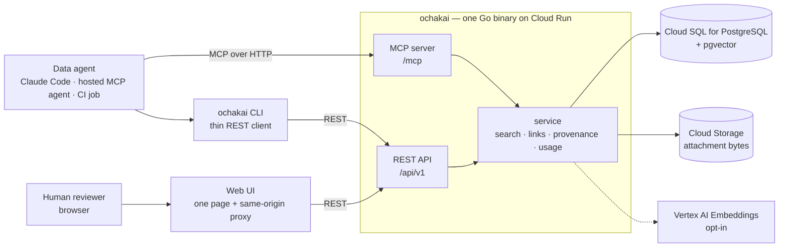

# Architecture

This page is a summary. The decisions it describes are recorded in the
numbered decision records under [docs/design](design) — mostly in
Japanese, and authoritative where this page and they disagree. Start from
[the index](design/README.md): it groups every record by area and marks
which ones still describe the current state, and
[README.en.md](design/README.en.md) beside it summarizes each record in
English. Sections below cite the
record they rest on as `(design doc NNNN)`, the way the
[README](../README.md) does.

## What it is

ochakai is one Go binary in front of a PostgreSQL database. It stores
knowledge entries — metric definitions, verified golden queries,
interpretation notes, glossary terms, table catalog entries — and serves
them to data agents over MCP, a REST API, a CLI, and a bundled web UI.
Every entry carries who wrote it, who verified it, and when.

Two refusals shape everything else (design doc
[0001](design/0001-architecture.md)):

- **No LLM.** Nothing in the request path summarizes, rewrites, or
  interprets. What comes back is what a human or an agent wrote and a
  human verified. Embeddings are the one exception in spirit and not in
  fact: an encoder is deterministic and produces no text.
- **No SQL execution.** ochakai holds no warehouse credentials and has no
  way to reach your data. It returns the query; your agent runs it.

It also has no connector ingestion, no user database, and no
authorization system. The last of those is not an omission — see below.

The supported runtime is Google Cloud: Cloud Run for the process, Cloud
SQL for the database, optionally Vertex AI for embeddings (design doc
[0003](design/0003-gcp-only.md)). That decision superseded an earlier
"runs anywhere" position, and it was made for a reason worth knowing
before you adopt: the identity model — no tokens, no passwords, no
secrets — is built entirely on Google Cloud's IAM, and keeping a non-GCP
path alive meant keeping a second authentication path alive with it.
Portability is promised for the *data*, not the runtime: the knowledge
base round-trips through OKF bundles, which are plain markdown in git.
Local development runs against a plain PostgreSQL in Docker.

## Component layout

`serve` runs the MCP server and the REST API on one port, next to the
database. The CLI and the web UI are REST clients and hold no database
connection of their own (design doc
[0007](design/0007-api-only-cli.md)); the web UI is a single
self-contained page with no build step, served either from your loopback
by `ochakai ui` or as a team service by `ochakai serve-ui` — the same
container image, a different argument (design doc
[0006](design/0006-web-ui-serving.md)).

## Identity, provenance, and no authorization

**Whoever can reach the service can read and write it.** ochakai has no
roles, no scopes, no per-entry permissions, and no way to make a
read-only user (design doc [0002](design/0002-authn-authz.md)). This is
a decision, not a gap, and for some organizations it is a hard stop. Read
this section before the rest.

What ochakai does with an identity is *record* it. Cloud Run performs the
IAM check and forwards the verified caller identity in a header; ochakai
reads that header for one purpose — deciding whose name goes on the
entry. An email ending in `.gserviceaccount.com` becomes
`agent:<sa-email>`, anything else `human:<email>`. Nothing else consults
it. Promotion to `verified` is not restricted either: who verified an
entry is always recorded, so the decision about whether to trust it is
made by whoever reads the provenance, not by a gate at the write. The
phrase the record uses is that trust is secured *by recording, not by
authorizing*.

The consequences to plan around:

- **The service must be private.** On a public Cloud Run service the
  identity headers are self-asserted and the whole model collapses. IAM
  enforcement is the security boundary; the [deploy
  guide](../deploy/cloudrun/README.md) carries a hardening checklist.
- **An embedding application collapses its users into one identity.** An
  app that calls ochakai with its own service account records every one
  of its users as that service account. `X-Ochakai-On-Behalf-Of` fixes
  this for callers you list in `OCHAKAI_DELEGATING_CALLERS`; both
  identities are then recorded (`human:… via agent:…`), never just the
  forwarded one, and a delegation header from an unlisted caller is
  refused rather than quietly downgraded (design doc
  [0027](design/0027-delegated-provenance.md)). The team web UI does the
  same thing from an IAP-signed JWT, so browser edits are attributed to
  the person signed in (design doc
  [0032](design/0032-webui-iap-identity.md)).
- **Provenance is never read from a payload.** Import ignores the
  provenance keys in a bundle's frontmatter entirely. Provenance is what
  this instance observed, not what a document claims about itself
  (design docs [0009](design/0009-provenance-portability.md),
  [0035](design/0035-verifiability.md)).

A deployment can be made **read-only** with `OCHAKAI_READ_ONLY=true`
(design doc [0040](design/0040-read-only-mode.md)). This is not
authorization either, and for a sharper reason: it never looks at the
caller. It cannot be narrowed to some entries or some people, and it
refuses whoever operates the deployment exactly as it refuses anyone
else. The check sits in the service layer, which both REST and MCP come
through, so a write endpoint added later is covered without its author
knowing about it. Each surface says it in its own vocabulary — REST
answers 403 and marks every response `Ochakai-Read-Only: true`, MCP
simply does not offer the write tools, and the web UI stops drawing the
buttons. Usage telemetry keeps recording: a search hit is the server's
own observation, not content a caller wrote.

There is one narrow exception to "no authorization", and it is
deliberately framed as not being one: MCP refuses to overwrite, delete,
or change the status of an entry a human has curated — `verified`,
`rejected`, or `deprecated` — and refuses to revive such an entry's
soft-deleted tombstone with a create. The reasoning is visibility rather
than permission: a silently replaced verified golden query is discovered
only when somebody runs it and gets a wrong number, and MCP has no
conditional-write channel (no ETag) with which an agent could state what
it believed it was replacing. The human surfaces are unrestricted
(design doc [0015](design/0015-surface-consistency.md) §3.1).

## The data model

An entry is a common envelope, a markdown body, and whatever
producer-defined keys came with it. The envelope is OKF v0.2's schema
taken literally: every key the spec defines is a first-class field rather
than a bag entry, so an exported entry carries its trust and lifecycle
where a consumer that has never heard of ochakai will look for them
(design doc [0036](design/0036-okf-schema-first.md)). Keys OKF does not
define pass through into `attrs` and come back out at their original
top-level position.

**Identity is a path.** An entry's id is its address and its bundle
location: `queries/sales/monthly-revenue` is one entry, and the
directories are how you organize a knowledge base. A type is an attribute
of an entry, not part of its address, so the layout of an exported bundle
comes from ids alone (design doc
[0017](design/0017-path-addressing.md)). The canonical URI is that path
under the `ochakai://` scheme. `title` is optional — an entry without one
is displayed by the last segment of its id, the way a file is named by
its filename — and ids are NFC-normalized and searchable in their own
right (design doc [0022](design/0022-filename-as-name.md)).

Because the address is the path, the path is also something to search
within. `?prefix=` narrows a search or a `context` call to a subtree,
repeatable and OR-ed, so one call can cover two parts of the tree and
tell the answers apart by id (design doc
[0041](design/0041-path-scoped-search.md)). Matching is on segment
boundaries: `metrics` does not reach `metrics-legacy`. How much this
buys depends on what the directories mean — a tree grouped by kind is
already served by `--type`, while directories standing for teams,
domains or tenants are the case `--type` cannot express. ochakai
attaches no meaning to any path either way, and the filter is not an
access control: any caller may pass any prefix, and passing none returns
everything they could already reach.

**Types are an open set with a recommended vocabulary.** The spellings
are the OKF knowledge-catalog vocabulary verbatim — `Attested
Computation`, not a slug — so a bundle's types survive a round-trip with
no translation layer in between (design doc
[0023](design/0023-okf-type-vocabulary.md)). What earns a place in the
recommended eleven is SPEC §4.1's one demand of a producer — that the
spelling be descriptive and self-explanatory — read against the spellings
OKF itself supplies, in the spec's own examples and in its reference
bundles (design doc
[0038](design/0038-type-vocabulary-realignment.md)). Any
single-line string works as a type. `status`, by contrast, is a closed
set: `draft`, `verified`, `deprecated`, `rejected`. `rejected` is the
one that most stores lack — it records that a proposal was considered and
turned down, with the reason in `status_note`, so an agent can check
before re-proposing the same thing.

**Relationships come from the prose.** There is no links field. A
markdown link in the body — `[revenue](/metrics/revenue.md)`, a relative
path, or an `ochakai://` URI — is the edge; the target gains a backlink,
and rename rewrites the references pointing at it. What *kind* of
relationship it is comes from the sentence around it, so ochakai stores
no relationship vocabulary of its own (design doc
[0024](design/0024-links-from-body.md)). Links inside fenced code blocks
and inline code spans are examples and are skipped.

Every change is kept as a revision, and `delete` is a soft delete.
Discarding history is a second, explicit step — `purge`, available on
REST and the CLI only, which leaves an audit row behind and frees the id
(design doc [0031](design/0031-purge.md)).

## The four surfaces

REST, MCP, CLI, and the web UI are held to one rule: a feature lands on
all of them consistently, including where it deliberately lands on none
(design doc [0015](design/0015-surface-consistency.md)). Each has a
declared job.

| Surface | Job |
|---|---|
| REST `/api/v1` | The only contract. A feature lands here first or nowhere; limits, enums, and defaults live server-side. [api/openapi.yaml](../api/openapi.yaml) is the published wire surface |
| MCP `/mcp` | The agent's purpose-built entrance. Tool schemas cost the agent context, so the tool count is a budget — not a mirror of REST. `get_context` is the extreme case: one call returns everything the loop needs |
| CLI | The completeness surface. A pure REST client covering every operation, for humans and for agents with a shell |
| Web UI | The human half of the loop. Search, browse, review, history — a curation surface, not a BI tool. The page knows nothing about authentication, which is what lets one page ship two ways |

The value of writing the roles down is that it makes the omissions
reviewable. MCP carries no `browse` (walking a tree is multi-round-trip
exploration, the opposite of `get_context`), no `revisions` or
`backlinks` (duplicated or too heavy in tokens), no attachment writes
(base64 in a tool argument wastes tokens, and an agent's write-back
should be searchable text), no bulk export or import, and no `verify` —
re-verification is a human judgment. The web UI carries no outcome
reporting, because a surface that cannot run SQL would produce
worked/failed reports with no action behind them. REST carries no SQL
execution, no LLM features, no user management, and no bulk OKF import.

That last one is the single place the CLI is more than a thin client.
Loading a bundle is a loop over endpoints that already exist, so a
server-side second path to the same outcome would buy convenience rather
than capability — at the cost of a second implementation to keep in sync.
The acknowledged price is that bundle semantics live in the client, and
the mitigation is that [api/openapi.yaml](../api/openapi.yaml) spells out
what the loop does, so another implementation can reproduce it. The
record names the condition that would reverse the decision: a restore
demanded from an environment where the binary cannot be run (design doc
[0015](design/0015-surface-consistency.md) §3.2).

## Storage

One database. Entries, revisions, links, usage totals, and embedding
vectors all live in PostgreSQL — pgvector for the vectors, which Cloud
SQL and a plain Postgres both provide, so hybrid search adds no
infrastructure (design doc [0001](design/0001-architecture.md) §4).
There is no Redis, no separate vector database, and no search cluster.
Migrations ship in the binary.

Attachment *bytes* are the exception: they live in Cloud Storage and are
fetched on demand, with the entry keeping only the metadata (design doc
[0013](design/0013-attachment-files-gcs-only.md)). Accepted formats are
the intersection of what Claude can read and what Gemini can embed —
PNG, JPEG, WebP, PDF, plain text — sniffed from the bytes rather than
trusted from a filename. With `OCHAKAI_GCS_BUCKET` unset the instance
stores markdown entries only and attach operations return an error.
Attachments travel through OKF bundles as plain files beside their entry.

Usage recording is deliberately off the read path: events are buffered in
memory and flushed periodically, statistics are documented as
best-effort, an overrun is dropped rather than backing up the request,
and shutdown drains before a final flush (design doc
[0029](design/0029-usage-recording-off-the-read-path.md)). Concurrent
edits are handled by optional optimistic locking — `updated_at` as the
version, exposed as an ETag with `If-Match` (design doc
[0030](design/0030-optimistic-locking.md)).

## Search

Search has a lexical half and an optional vector half.

The lexical half exists in the shape it does because of Japanese.
PostgreSQL's full-text search does not tokenize it, so ochakai matches
query *fragments* against a stored haystack — id, title, description,
tags, body, attachment filenames. Latin tokens stay whole; a run of
Japanese, which has no spaces to split on, is cut into sliding
two-character windows, and only the windows carrying a kanji or katakana
are kept, since an all-hiragana window is grammar and matches nearly
everything. Ranking is by how much of the *rare* part of a query an entry
contains.

The cost is known and written down: a trigram index cannot serve a
two-character pattern — there is no whole trigram inside one — so a
Japanese term like 売上 is answered by a table scan. Measured on 5000
entries that is about 16 ms against 0.2 ms for an indexed Latin word.
Three-character windows would restore the index and lose exactly the
terms the search exists to find, so the scan is the price. It is fine at
the scale a curated knowledge base reaches, and it does not stay fine
forever.

Setting `OCHAKAI_VERTEX_PROJECT` turns on the vector half: Vertex AI
embeddings, authenticated by ADC with no API key to hold, fused with the
lexical ranking by reciprocal rank fusion. It is off by default, which is
what makes "calls no external API unless you opt in" true. Vectors are
written when an entry is written, so enabling embeddings on an existing
base — or changing the model — leaves older entries unembedded until
`ochakai reembed` runs (design doc
[0020](design/0020-attachment-search.md)). Attachments join the same
search: filenames match lexically always, contents join the vector half
when embeddings are on, and a hit is always the owning entry rather than
the file.

Scores are not calibrated and are not comparable between the two modes.
Treat them as an ordering. To bound what comes back, use the byte
budget rather than a score threshold: `get_context` returns full entries
up to the budget and names the rest as outline rows, and `hits` carry a
ranking only — id, type, title, status, score — never a second copy of
the knowledge (design doc
[0033](design/0033-context-hits-are-a-ranking.md)).

## The write-back and verification loop

The bet in design doc [0001](design/0001-architecture.md) is that agents
supply the breadth and humans supply the judgment. An agent writes what
it learned as a `draft`; a human promotes it to `verified`, deprecates
it, or rejects it with a reason. Provenance and revisions make that
reviewable after the fact.

What closes the loop is the machinery for noticing that verified
knowledge has stopped being true (design doc
[0025](design/0025-closing-the-loop.md), extended by design doc
[0037](design/0037-stale-and-source-lookup.md)):

| Feed | What it lists | What empties it |
|---|---|---|
| `sort=verified_at` | Verified entries by verification age, oldest first | Re-verifying — `POST /api/v1/verify/{id}` stamps a fresh `verified_at` |
| `sort=failed` | Entries with unanswered `failed` outcome reports, worst first | Re-verifying, same call |
| `sort=stale_after` | Entries past the expiry their own author declared | Editing the entry to re-declare the date |

`report_outcome` is the evidence-based half: an agent that ran a golden
query and got a wrong number says so, and the entry rises in the second
feed instead of being trusted blind by the next agent. Verification is
its own operation rather than an update, for a reason the record spells
out: an update that changes nothing writes nothing, so "I checked it
again and it is still right" would land nowhere (design doc
[0025](design/0025-closing-the-loop.md) §6). The third feed clears
differently because `stale_after` is a claim its author made rather than
something the server observed — re-verifying does not answer it; editing
does. The reverse lookup added alongside it answers the other direction:
`?source=<uri>` lists every entry derived from a document that has
changed.

Running verified golden queries on a schedule and writing the result back
is the operational form of all this:
[docs/guides/golden-query-canary.md](guides/golden-query-canary.md). The
execution stays on your side, since ochakai does not run SQL.

## How correctness is enforced

Most of ochakai's invariants are not expressible in Go's type system —
`Status` is a string alias, and a validated id has the same type as any
other string. Rather than build an abstraction that imitates a type
system, design doc [0035](design/0035-verifiability.md) puts three
machines outside the code to check three specific things.

- **Exhaustiveness.** golangci-lint with `exhaustive` as the centerpiece:
  adding a value to a closed set makes every switch that meant to name
  them all fail the build. Switches with a `default` are exempt, having
  already declared how they treat what they did not name. The selection
  rule for every linter enabled is *zero findings on a clean tree*, so a
  finding always means new code did something and never means the linter
  has opinions. Configuration is in [.golangci.yml](../.golangci.yml).
- **The wire contract.** [api/openapi.yaml](../api/openapi.yaml) is
  declared the public surface, and a contract test now validates every
  request and response passing through the REST integration tests against
  it. No code generator: handlers stay hand-written, because designing
  each surface's meaning deliberately is the point of design doc 0015,
  and at this size a test keeps the spec in sync as well as generation
  would.
- **Properties.** Go's native fuzzing covers the OKF parser — the one
  place untrusted input enters — id and link derivation, and the export →
  import round-trip that design doc 0036 asserts is exact. Seed corpora
  replay under an ordinary `go test`, so CI needs no new shape.

Alongside those, CI runs `gofmt -l .`, `go vet`, `go test -race`, a
`CGO_ENABLED=0` build, and `govulncheck` — all of it through
`scripts/check`, which is also what a contributor runs, so the two cannot
drift. [CONTRIBUTING.md](../CONTRIBUTING.md) has the invocations and the
setup for the store integration tests.
Images are published with SBOM and SLSA provenance, and workflow actions
are pinned by commit SHA.

## Where to go next

- [docs/design/README.md](design/README.md) — the decision records, by
  area. The authoritative source for everything above.
- [api/openapi.yaml](../api/openapi.yaml) — the wire surface.
- [deploy/cloudrun/README.md](../deploy/cloudrun/README.md) — the
  deployment walkthrough and the hardening checklist.
- [docs/guides/golden-query-canary.md](guides/golden-query-canary.md) —
  running verified queries as canaries.
