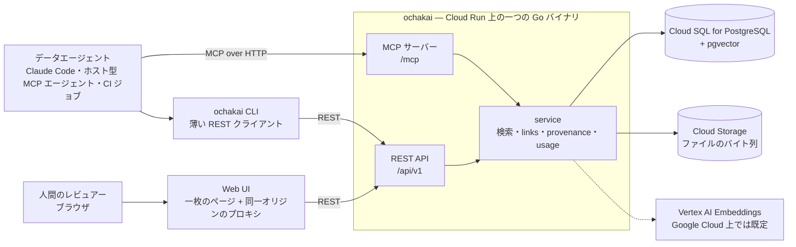

# アーキテクチャ

このページはマニュアルの参照側である: concept とは何か、それがどう
住所を持つか、検索が何をするか、そして部品がどう組み合わさるか。
**ochakai が何であり、なぜ選ぶか**は [README](../README.md) にあり、
このページはそれを読んで作業を始めた人を前提にする。

ここで説明する決定は [docs/design](design) 配下の番号付き decision
record に記録されている — 大半は日本語で、このページと食い違えば
そちらが正である。まず [index](design/README.md) から: すべての
record を分野別にまとめ、どれが今の状態を説明しているかを示している。
横にある [README.en.md](design/README.en.md) は各 record を英語で
要約する。以下の節は、それぞれが依拠する record を
`(設計ドキュメント NNNN)` として引用する — [README](../README.md) と
同じやり方である。

## コンポーネント構成



`serve` は MCP サーバーと REST API を一つのポートで、データベースの
隣で動かす。CLI と web UI は REST クライアントであり、自分自身の
データベース接続を持たない(設計ドキュメント
[0067](design/0067-four-faces-and-what-they-decline.md) §2)。web UI はビルドステップの無い
一枚の自己完結したページで、`ochakai ui` によってループバックから、
あるいは `ochakai serve-ui` によってチームのサービスとして配られる —
同じコンテナイメージに、違う引数を渡すだけである(設計ドキュメント
[0072](design/0072-the-web-ui-serves-and-edits-documents.md) §1)。

## Identity と provenance、そして既定では認可は無い

**デプロイに届く者は誰でも読み書きできる。** ディレクトリごとに閲覧者と
編集者を持たせる任意のアクセスポリシー(設計ドキュメント
[0109](design/0109-a-directory-has-readers-and-writers.md))を書かない
かぎり、これが全部である — そして**書かないのが既定であり、既定のままの
デプロイにとってこの節は一字も変わっていない。** それが運用上
何を意味するか、そしてそれを狭める姿勢は
[要件と設定](configuration.md#authentication-has-no-configuration)
(設計ドキュメント [0065](design/0065-identity-and-provenance.md) §1)にある。この
節はその*理由*である。

ochakai が identity に対してすることは*記録*だけであり、目的は一つ
— concept に誰の名前を載せるかを決めることである(identity 自体が
どう読まれるかは
[要件と設定](configuration.md#authentication-has-no-configuration)
にある)。concept の検証も制限されていない: 誰が検証したかは常に
記録されるので、それを信頼するかどうかの判断は provenance を読む側が
行うのであって、書き込み側の門番が行うのではない。record が使う
言い回しで言えば、trust は*認可によってではなく記録によって*担保
される。

計画するうえで踏まえておく帰結:

- **サービスは非公開でなければならない。** 公開された Cloud Run
  サービスでは identity ヘッダーは自称にすぎず、モデル全体が崩壊
  する。IAM による強制がセキュリティ境界であり、
  [運用ガイド](guides/operating.md#hardening) に hardening の
  チェックリストがある。
- **組み込んだアプリケーションは利用者を一つの identity に潰す。**
  自分自身のサービスアカウントで ochakai を呼ぶアプリは、その
  利用者全員を同じサービスアカウントとして記録する。
  [Delegated provenance](guides/rest-integration.md#delegated-provenance-forwarding-who-used-your-product)
  は、運用者が明示的に一覧した呼び出し元についてこれを解消する
  (設計ドキュメント [0065](design/0065-identity-and-provenance.md) §3)。
  team web UI は IAP が署名した JWT から同じことを行う(設計
  ドキュメント [0065](design/0065-identity-and-provenance.md) §5)。
- **identity が言うのは誰かであって、何かではない。** 本人の
  資格情報の下で書き込むエージェント — MCP クライアント、スクリプト
  内の CLI — はその人物を記録し、record はまるで本人が文章を書いた
  かのように読める。`Ochakai-Producer: insightflow/1.4.0`(あるいは
  MCP ではクライアントの `initialize` 情報)がソフトウェアの名前を
  伝える。これは actor の**隣に**記録され、決してその代わりには
  ならない — ここで唯一、呼び出し元が認証によって観測されたのでは
  なく自分自身について宣言するものだからである(設計ドキュメント
  [0065](design/0065-identity-and-provenance.md) §4)。
- **provenance がペイロードから読まれることは無い。** import は
  バンドルの frontmatter から ledger へ何も持ち込まず、そこにある
  何も trust の段階を動かさない。provenance はこのインスタンスが
  観測したものであって、文書が自分自身について主張していることでは
  ない(設計ドキュメント [0009](design/0009-provenance-portability.md)、
  [0035](design/0035-verifiability.md))。文書が主張していることは、
  捨てられるのではなく主張だと明示された形で保持される — 下の
  データモデルを見よ。

デプロイは**read-only**にできる。これも認可ではなく、しかもより鋭い
理由による: このチェックは呼び出し元を一切見ないので、デプロイを
運用する者もそれ以外の誰かとまったく同じように拒む。REST と MCP が
どちらも通るサービス層に置かれているので、後から追加される書き込み
エンドポイントも、その作者が意識せずとも対象になる。各サーフェスが
それについて何をするか、そして identity を読むこと自体をやめる
姉妹の**public**姿勢については
[要件と設定](configuration.md#environment-variables)
(設計ドキュメント [0066](design/0066-four-postures-one-word.md) §2・§3)にある。

「認可は無い」には、アクセスポリシー(0109)のほかにもう一つ狭い例外が
あり、そちらは意図して認可ではないと位置づけられている: MCP は、人間が裁定した concept —
verified・rejected・deprecated — を上書き・変更することを
拒み、そうした concept のソフトデリートされた tombstone を create
で蘇らせることも拒む(削除はそもそもツールが無い — 設計ドキュメント
[0076](design/0076-two-tools-leave-mcp.md))。その理由は権限ではなく
可視性である: 静かに
置き換えられた verified の golden query は、誰かがそれを実行して
違う数字を得たときにしか発覚せず、しかも MCP には条件付き書き込みの
経路(ETag)が無いので、エージェントは自分が何を置き換えるつもり
だったかを示すすべを持たない。人間向けのサーフェスは制限されない
(設計ドキュメント [0067](design/0067-four-faces-and-what-they-decline.md) §6)。

<a id="the-data-model"></a>

## データモデル

**concept とは [OKF](https://github.com/GoogleCloudPlatform/knowledge-catalog/tree/main/okf)
v0.2 文書である** — YAML の frontmatter の後に markdown 本文が続く —
そしてそれが保存形式であり、ワイヤ形式であり、export 形式でもある
(設計ドキュメント [0075](design/0075-the-bundle-is-the-address-space.md) §3。
*文書だけが真実*をバイトレベルまで落とし込んでいる:
書き込みが保存するのは受け取ったバイト列そのものであり、正準形式は
そこから導かれる)。concept を読み、
編集し、送り返すのは変換の入らない一つのループである — id が、
両端で住所になる:

```sh
curl -X PUT http://localhost:8080/api/v1/bundle/metrics/revenue.md \
  -H 'content-type: text/markdown' \
  --data-binary $'---\ntype: Metric\n---\n\nCompleted orders only, net of refunds.\n'
```

文書の隣にあるデータベースの列は、そこから導かれた索引であり、sort
や filter に使われる — 両者が食い違い得る場面では文書が正しい。OKF
が定義していないキーは、書き手が置いた場所そのまま保たれる —
トップレベルでも、`sources` のエントリの中でも、parameter・
executor・attester の中でも。取り込み時に捨てたキーは、後の
リリースが二度と取り戻せないキーだからである。

concept のバージョンは、保存された文書のハッシュであり、読み取りは
これを `ETag` として返し、書き込みは `If-Match` として受け取る。
文書だけのハッシュであるため、concept を確認すること、reject する
こと、ファイルを添付することはどれも、保持していた precondition を
有効なままにする。concept を整形し直すとこれは動く — ファイルは
実際に変わったからである — が、concept が*言っている*ことは変わって
おらず、それを伝えるのが `generated.at` である。

**type は閉じていない集合で、推奨 vocabulary を持つ。**

| Type | 何を持つか |
|---|---|
| `Metric` | セマンティックなメトリック定義、同義語 |
| `Attested Computation` | 承認された computation と、その実行を確認する手段: computation は本文の `# Computation` フェンスに、契約は `runtime` / `parameters` / `executor` / `attester` の各フィールドにある。ochakai はこれを記録するだけで、決して実行しない。golden query はこの一種である: `runtime` が SQL がどこで動くかを言い、`question` のような producer 側のキーがそれが答える問いを運ぶ |
| `Skill` | concept の `executor.resource` が指す手順 — 与えられた runtime で computation を実際にどう動かすか |
| `Insight` | メトリックの読み方: baseline、季節性、注意点、閾値 |
| `Policy` | 数字を決めるルール — revenue recognition、cost allocation。concept の `sources[].resource` が引用するもの |
| `Glossary Term` | 用語集の項目 |
| `BigQuery Dataset` | BigQuery データセットのカタログエントリ: table をまとめるコンテナ |
| `BigQuery Table` | BigQuery table のカタログエントリ: source、列の注記、既知の問題 |
| `Reference` | 外部資料の写し: enum の定義、ライセンス、スキーマ文書 |

これらは推奨であって閉じた集合ではない: 一行に収まる文字列なら
何でも、自分自身の文書の種類の type として使える。綴りは OKF の
knowledge-catalog vocabulary をそのまま使う — スラッグではなく
`Attested Computation` — ので、バンドルの type は間に変換層を挟まず
round trip を生き残る。推奨の九つに入る資格を得るのは、SPEC §4.1 が
producer に課すただ一つの要求 — 綴りが descriptive で
self-explanatory であること — を、OKF 自身が spec の例やその
reference bundle で示している綴りに照らして判断した結果である
(設計ドキュメント [0071](design/0071-the-recommended-type-vocabulary.md) §3)。マッチングは
大文字小文字を区別しない — 保存されるのは書いた綴りそのものである。

**identity とはパスである。** concept の id はその住所であり bundle
上の場所でもある: `queries/sales/monthly-revenue` は一つの concept
であり、ディレクトリはナレッジベースをどう組織するかを表す — type
は concept の属性であって住所の一部ではないので、export した
bundle のレイアウトは id だけから決まる(設計ドキュメント
[0075](design/0075-the-bundle-is-the-address-space.md) §2)。MCP は concept を、
`ochakai://` スキームの下でそのパスによる resource として住所づける
— これは MCP のための URI であって、bundle の中を旅することは無い。
`title` は省略でき、それを持たない concept は id の最後のセグメント
で表示される — ファイルがファイル名で呼ばれるのと同じである — そして
id は NFC 正規化されており、それ自体が検索対象でもある(設計
ドキュメント [0074](design/0074-the-document-and-the-vocabulary-that-asks-it.md) §1)。

住所がパスであるということは、パスもまた検索の対象になるという
ことである。`--prefix`(REST では `?prefix=`、MCP では `prefixes`)
は検索や `context` の呼び出しを一つの subtree に絞り込む — 繰り返し
指定でき、OR で結ばれるので、一回の呼び出しで木の二箇所をカバーし、
id で答えを見分けられる(設計ドキュメント
[0075](design/0075-the-bundle-is-the-address-space.md) §6)。マッチングはセグメント
境界で行われる: `metrics` は `metrics-legacy` には届かない。これが
どれだけ役に立つかはディレクトリが何を意味するかによる —
[examples/demo](../examples/demo) は種類でグループ化しており
(`metrics/`、`glossary/`、`queries/sales/`)、そこでは `--type` が
すでに同じことのほとんどをやっている。これが効いてくるのは、共有の
vocabulary の隣にあるチーム独自の vocabulary のように、ディレクトリ
が `--type` では言えない何かを意味しているときである。ochakai は
どちらの場合もパスに意味を持たせておらず、このフィルタはアクセス
制御ではない: どの呼び出し元もどんな prefix でも渡してよく、何も
渡さなければ既に届く範囲すべてが返る。

**関係は本文から来る。** links フィールドは無い。本文中の markdown
リンク — `[revenue](/metrics/revenue.md)` や相対パス
(`./gross.md`)— この二つが OKF SPEC §6 が定義する形式であり、それが
すべてである — が edge になる。リンク先は backlink を得て、concept の
読みはその逆向きの edge を `linked_from` の行として連れて返る
([0106](design/0106-a-read-carries-what-points-at-it.md))。どんな種類の関係かは
その周りの文が語るので、ochakai は自分自身の関係 vocabulary を一切
保存しない(設計ドキュメント [0074](design/0074-the-document-and-the-vocabulary-that-asks-it.md) §2)。
フェンスされたコードブロック(``` や ~~~)の中のリンクとインラインの
`` `code span` `` は例として扱われスキップされる — インデントされた
コードは検出されないので、4 スペース分インデントされたリンクは本文
として読まれる。concept の名前を変えると、それを指す参照も本文ごと
書き換わる。

**Files** は concept の隣に住む — insight の裏にある dashboard の
スクリーンショット、table concept の裏にある ER 図、dataset の裏に
ある seeds.txt や spec の PDF — そして OKF bundle を通じて、その隣の
ただのファイルとして round trip する。**メディアタイプを理由に拒む
ことはしない** — ファイルが消えて戻ってくる bundle は、渡したはずの
bundle ではないからである。埋め込みが効くのは PNG・JPEG・WebP・PDF・
プレーンテキストで、それ以外も保存され配信される。型はファイル名から
ではなくバイト列を sniff して決まる — これは 0075 §4 が bundle
address に畳み込んでいる操作の一つで、その畳み込みはまだ着地の途中
だからである。バイト列は Cloud Storage に置かれ、必要になったときに
取得される。1 オブジェクトあたり 5 MiB まで、住所を保持するのは
データベースの側である(設計
ドキュメント [0075](design/0075-the-bundle-is-the-address-space.md) §1)。`OCHAKAI_GCS_BUCKET` が
未設定なら、そのインスタンスは markdown の concept だけを保存し、
markdown 以外の書き込みは拒否される。Files は検索対象でもある:
ファイル名はすべての検索でマッチし、内容は embeddings が有効な
ところではハイブリッド検索に加わる — テキストはどの embedding
model でも、画像と PDF は `gemini-embedding-2` で。ヒットは常に
それを持つ concept であって、ファイル自身がヒットすることは無い
(設計ドキュメント [0080](design/0080-search-and-how-a-deployment-embeds.md) §4)。

**trust はナレッジと一緒に旅をする。** OKF v0.2 のスキーマは
ochakai のスキーマでもある: spec が定義するキーはすべて第一級の
フィールドなので、export された concept は provenance と trust と
lifecycle(SPEC §5)を、ochakai を聞いたことも無い consumer が探す
まさにその場所に運ぶ。

```yaml
type: Attested Computation
runtime: bigquery
title: Monthly revenue by channel
sources:
  - id: rev-policy
    resource: https://wiki.example/finance/revenue-recognition
    title: Revenue Recognition Policy (FY2026)
    author: human:jsmith@example.co.jp
    last_modified: "2026-06-15"
usage_window: { from: "2026-06-01", to: "2026-06-30" }
generated: { by: process:analyst@example.iam.gserviceaccount.com, producer: insightflow/1.4.0, at: 2026-07-26T04:12:00Z }
verified:
  - { by: human:tanaka@example.co.jp, at: 2026-07-26T09:30:00Z }
status: stable                 # draft | stable | deprecated
stale_after: "2026-12-31"      # 参考情報: この日以降に見直す
```

`sources` は concept が依拠する材料である — 一つに `id` を与えれば、
本文中の markdown の脚注がその一つの主張の出典を示せる。`generated`
はその内容の後ろに誰が立っているか、いつ最後に変わったかを言い、
`verified` は誰がそれを確認したかを言う — 無ければ unverified を
意味し、`human:` のエントリがあってはじめて human-reviewed になる
(SPEC §5.3)。ochakai はこれらを spec が定義するとおりに保持する:
`status` は lifecycle の値だけを持ち(`draft`、`stable`、
`deprecated` — SPEC §5.4)、`verified` は確認のたびに追記される
だけの ledger であり、この二つの信号は独立したまま保たれる。誰かが
確認した draft も、誰も確認していない stable な concept も、どちら
もこのモデルが持てる状態であり、他所の bundle の lifecycle の値も
そのままの姿で旅を終える。

rejection — レビューされて*受け入れられなかった*こと — は concept
の段階ではなくこのインスタンスの裁定なので、status でもない。
そしてこれはほとんどのストアが持たない記録である: エージェントは
同じことを再提案する前にこれを確認できる。export では concept の
本当の status の隣に `rejected_by` / `rejected_at` /
`rejected_note` として現れ、import はそれを二度と読み戻さない —
bundle が運ぶのはナレッジであって、一つのインスタンスの判断では
ないからである(設計ドキュメント
[0075](design/0075-the-bundle-is-the-address-space.md) §3.1)。
理由まで書き出すのは、**裁定のうち次の書き手が使えるのは理由だけ**
だからである([0104](design/0104-a-ruling-travels-with-its-reason.md))。

ochakai はこれらを**記録する**だけで、決してそれをもとに動かない。
source の `resource` を取得することも、その信頼性の信号を採点する
ことも、Attested Computation の `executor` と `attester` を実行する
ことも無い — 信号を重み付けすることと computation を実行することは、
concept を消費する側の仕事である(SPEC §5.1、§10.5)。

すべての変更はリビジョンとして保持され、`delete` はソフトデリート
である。履歴を捨てるのは第二の、明示的なステップ — REST と CLI に
だけある `purge` で、監査行を一つ残して id を解放する(設計
ドキュメント [0031](design/0031-purge.md))。

## 四つのサーフェス

REST、MCP、CLI、web UI は一つのルールに従う: 機能はこのすべてに
一貫して現れる — 意図してどれにも現れない場合も含めて(設計
ドキュメント [0067](design/0067-four-faces-and-what-they-decline.md))。それぞれ
に宣言された役目がある。

| Surface | 役目 |
|---|---|
| REST `/api/v1` | 唯一の契約。機能はまずここに現れるか、どこにも現れない。limit・enum・既定値はすべてサーバー側にある。[api/openapi.yaml](../api/openapi.yaml) が公開されたワイヤサーフェスである |
| MCP `/mcp` | エージェント専用に作られた入口。tool schema はエージェントの context を消費するので、tool の数は予算である — REST の写しではない。読みは search → get の二本で、fetch した concept が `linked_from` まで運ぶ |
| CLI | 完全性のサーフェス。すべての操作をカバーする、純粋な REST クライアント。人間にも、シェルを持つエージェントにも |
| Web UI | ループの人間側の半分。検索・browse・review・履歴 — curation のためのサーフェスであって BI ツールではない。このページは認証について何も知らず、それが一枚のページを二通りに出荷できる理由である |

役目を書き出すことの価値は、それが省略を review 可能にすることで
ある。MCP には `browse` が無く(発見は検索の仕事である)、
`revisions` も `links_to` の逆引きも無い(重複するか token として
重すぎる — concept を指しているものが欲しいエージェントは、
`get_concept` の `linked_from` でそれを得る)、ファイルの書き込みも無く(tool の引数の中の
base64 は token の無駄であり、エージェントの書き戻しは検索可能な
テキストであるべきである)、一括の export も import も無く、
`verify` も `delete` も無い — 裁定は人間が下すものだからである
(設計ドキュメント [0076](design/0076-two-tools-leave-mcp.md))。
利用回数の合計も無い — それを読んで動くのは人である。web UI には
outcome の報告が無い。SQL を実行できないサーフェスが worked/failed
の報告を作っても、その裏に行動が無いからである。REST には SQL の
実行も、LLM の機能も、ユーザー管理も、一括の OKF import も無い。

その最後の一つが、CLI が薄いクライアント以上のものになる唯一の
場所である。bundle を読み込むことは既に存在するエンドポイント群への
ループなので、同じ結果へのサーバー側の第二の経路を作っても、買える
のは capability ではなく convenience でしかない — しかも同期を保つ
べき二つ目の実装というコストを払って。認めている代償は bundle の
意味論がクライアント側に住むことであり、その緩和策は
[api/openapi.yaml](../api/openapi.yaml) がそのループが何をしているか
を書き尽くしていて、別の実装がそれを再現できることである。この決定
を覆す条件も record は名指している: バイナリを動かせない環境から
restore を求められたときである(設計ドキュメント
[0067](design/0067-four-faces-and-what-they-decline.md) §5.2)。

## ストレージ

データベースは一つだけである。concept、リビジョン、リンク、利用の
合計、そして埋め込みベクトルはすべて PostgreSQL に住む — ベクトルに
は pgvector を使い、これは Cloud SQL でもプレーンな Postgres でも
使えるので、ハイブリッド検索は追加のインフラを一つも要らない(設計
ドキュメント [0081](design/0081-what-ochakai-is-and-what-it-refuses-to-hold.md) §2)。Redis も、
別のベクトルデータベースも、検索クラスタも無い。マイグレーションは
バイナリの中に入って出荷される。markdown 以外のバイト列だけは例外
で、上の Files の節で述べたとおり Cloud Storage に住む。

利用の記録は意図して読み取りの経路の外に置かれている: イベントは
メモリ上にバッファされ、定期的にフラッシュされる。統計は
best-effort だと文書化されており、あふれた分はリクエストを詰まらせ
るのではなく捨てられ、shutdown は最後のフラッシュの前に drain する
(設計ドキュメント [0069](design/0069-the-loop-and-what-measures-it.md) §3)。
同時編集は同じ文書のハッシュに対する楽観的ロックで扱われる(設計
ドキュメント [0030](design/0030-optimistic-locking.md))。

<a id="search"></a>

## 検索

検索には字句面と、任意のベクトル面がある。

字句面が今の形をしているのは日本語のためである。PostgreSQL の全文
検索はそれをトークン化しないので、ochakai はクエリの*断片*を保存
された haystack — id、title、description、tags、本文、その
files のファイル名、そして書き手が与えた別名(`synonyms`)— に
対してマッチさせる。ラテン文字のトークンは
そのまま残る。日本語の連続は、区切る空白が無いので、二文字の
スライディングウィンドウに切られ、そのうち漢字かカタカナを含む
ウィンドウだけが残る — ひらがなだけのウィンドウは文法であってほぼ
何にでもマッチしてしまうからである。concept はクエリの*レア*な部分
をどれだけ含むかで ranking される — これはキーワードにも日本語の
質問にも正しい concept を見つけるが、それでも bag of words である
ことに変わりはない: 語順も文脈も読まない。

`synonyms` は producer のキーであって ochakai が定義するキーではない
— 索引が読むだけで、検証もせず、専用のフィルタも持たない。倉庫の列が
`revenue` で会議に出る語が `売上` のとき、その二つを結ぶ場所がこれで
ある(設計ドキュメント
[0105](design/0105-a-concept-answers-to-its-other-names.md))。他の
producer キーは索引しない: concept の別名ではなく concept についての
値なので、入れると「参照しているだけの concept」が一致として返り始める。

**名前で呼ばれた concept は、その語に触れただけの文書より上に出る。**
断片をどれだけ含むかだけで順位が決まるなら、用語を三つ並べた質問
(「EC事業のアクティブ会員の継続率を計算して」)の答えは、三語すべてに
一度ずつ触れた議事録になる — 各用語の定義は自分の一語しか含まないから
である。そこで ochakai はクエリの**用語** — ひらがなの間に挟まれた、
漢字かカタカナを含む連なり — を取り出し、その名前を持つ concept を
上に出す。名前は二つとも効く: `title` と、id の最後のセグメント
(設計ドキュメント [0022](design/0022-filename-as-name.md))。
空白で語を区切る言語ではこれをしない — 英語の質問に出てくる
"revenue" は、revenue という名前の concept を引きに来たわけではない
からである。

**この規則は綴りが一致したときだけ効く。** 「売り上げ」のように
ひらがなを含む名前はここで切れてしまうので、そういう用語は**送り仮名
を落としたパスに置き、title にゆれた綴りを書く** — `metrics/売上` に
`title: 売り上げ` なら、どちらの綴りで訊かれても名前として当たる。
第三の綴りは定義の本文に書いておけば、字句面が本文で拾う。ochakai は
表記ゆれの辞書を持たない — 別名はナレッジ側のデータであって、
検索の規則ではない。

**その断片は索引で引かれる。** 0016 が置いた trigram 索引は二文字の
パターンには使えず — その中に丸ごとの trigram が一つも無い — 売上
のような語はテーブルスキャンで答えられていた。migration 0036 が
`search_tsv` 生成列と GIN 索引に置き換えている: ラテン文字は
`english` 辞書で語幹化され(`revenues` が `revenue` に当たる)、空白で
区切らない文字列は上と同じ二文字ウィンドウが `simple` の lexeme と
して入る。`'%売上%'` という部分文字列テストが `売上` という lexeme の
等値検索になり、コーパスは読まれなくなった。索引を実際に使っている
ことは EXPLAIN を読むテストが押さえている
(`internal/store/searchtsv_integration_test.go`)。クエリ全体が
そのまま現れるかを見るボーナスだけは今も `search_text` への部分文字列
テストだが、索引が選んだ行を読むだけなので走査は増えない。

ベクトル面 — Vertex AI の embeddings で、認証は ADC、持つべき API
キーは無い。字句面の ranking とは reciprocal rank fusion で融合
される — は、**ochakai が Google Cloud 上で動いているところでは
既定で on になる**(設計ドキュメント
[0080](design/0080-search-and-how-a-deployment-embeds.md) §1。何がそれを決めるか、
どう断るかは[要件と設定](configuration.md#environment-variables)に
ある)。ベクトルは concept が書かれたときに書かれるので、embeddings
が届く前に読み込んだベースや、model を変えた後のベースは、
`ochakai reembed` を走らせるまで古い concept が埋め込まれないまま
になる。

**クエリを埋め込めなかったときは字句面だけで答え、応答がそう言う** —
検索の答えの `degraded: true`(設計ドキュメント
[0114](design/0114-a-degraded-ranking-says-so.md))。検索ごと失敗させる
より字句の一致を返すほうがよいが、**そのとき薄い結果を受け取った側に、
問いが悪かったのか埋め込みが落ちていたのかが分からない**のは別の話で
ある。埋め込みを設定していないデプロイはこれを立てない — そこでは字句
のみが答えであって、落ちた結果ではないからである。

score は較正されておらず、二つのモード間で比較できるものでもない。
順序として扱うこと。返ってくるものを絞るには、score の閾値ではなく
`limit` を使う(設計ドキュメント
[0068](design/0068-how-a-face-is-added-and-removed.md) §3)。検索の hit も
同じ種類のものである: 一行が concept を名指し、何がそれを ranking
したかを言い、文書自体は id で一回取得すれば手に入る(設計
ドキュメント [0075](design/0075-the-bundle-is-the-address-space.md) §4)。

## 書き戻しと検証のループ

設計ドキュメント [0081](design/0081-what-ochakai-is-and-what-it-refuses-to-hold.md) が賭けている
のは、エージェントが広さを、人間が判断を供給するということである:
エージェントは学んだことを `draft` として書き、人間はそれを
確認するか、deprecate するか、理由を付けて reject する。provenance
とリビジョンが、それを後から review 可能にする。この三つのフィード
に対してキュレーターが何をするか、それぞれを空にするために何が
要るかは[改善ループ](loop.md)にある。

その形について、あちらではなくここに書くべきことが二つある。
**検証は更新ではなくそれ自身の操作である** — `ruling: verified` を
付けた `POST /api/v1/review/{id}` が concept の ledger に追記する。
なぜなら、何も変えない更新は何も書き込まないので、「もう一度確かめた、
まだ正しい」がどこにも着地しないからである(設計ドキュメント
[0069](design/0069-the-loop-and-what-measures-it.md) §2。宣言した期限と
引用元からの逆引きは同 §2.2・§2.3 が拡張している)。
そして**`stale_after` は再検証によってではなく編集によって片づく**
— これはサーバーが観測したものではなく、その著者が立てた主張だから
である。

## 正しさはどう強制されているか

ochakai の不変条件のほとんどは Go の型システムでは表現できない —
`Status` は文字列のエイリアスであり、validate 済みの id もただの
文字列と同じ型を持つ。型システムを模倣する抽象を作る代わりに、
設計ドキュメント [0035](design/0035-verifiability.md) はコードの
外に三つの機械を置き、三つの具体的なことを確認させている。

- **Exhaustiveness。** golangci-lint の `exhaustive` を中心に
  据えている: 閉じた集合に値を一つ足すと、それを全部名指すつもり
  だったすべての switch がビルドを失敗させる。`default` を持つ
  switch は免除される — 名指さなかったものをどう扱うか、既に宣言
  しているからである。有効にしているすべての linter を選ぶ基準は
  *きれいな木の上で findings がゼロであること*なので、finding は
  常に新しいコードが何かをしたことを意味し、linter が意見を持って
  いることを意味することは無い。設定は
  [.golangci.yml](../.golangci.yml) にある。
- **ワイヤの契約。** [api/openapi.yaml](../api/openapi.yaml) が
  公開サーフェスだと宣言されており、契約テストが REST の統合
  テストを通るすべてのリクエストとレスポンスをこれに照らして
  検証する。コード生成器は使わない: handler は手書きのままである。
  各サーフェスの意味を意図して設計することが設計ドキュメント
  0067 の要点であり、この規模なら生成と同じだけの精度でテストが
  spec を同期させ続けられるからである。
- **Properties。** Go 標準の fuzzing が、信頼されない入力が入って
  くる唯一の場所である OKF parser、id と link の導出、そして設計
  ドキュメント 0075 §3 が厳密であると主張する export → import の
  round trip をカバーする。seed corpus は普通の `go test` の下で
  再生されるので、CI に新しい形は要らない。

これらはすべて `scripts/check` を通して動く。これは contributor
自身が走らせるものでもあるので、CI とローカルのチェックがずれる
ことはない — 呼び出し方は [CONTRIBUTING.md](../CONTRIBUTING.md) に
ある。イメージは SBOM と SLSA provenance 付きで公開され、workflow
の action は commit SHA で固定されている。

## 次に読むもの

- [docs/design/README.md](design/README.md) — decision record を
  分野別にまとめた索引。上のすべてについて権威ある情報源である。
- [api/openapi.yaml](../api/openapi.yaml) — ワイヤサーフェス。
- [examples/demo](../examples/demo) — このページが説明するレイアウト・
  type・リンクを備えた、11 concept のナレッジベース。
- [deploy/cloudrun/README.md](../deploy/cloudrun/README.md) —
  デプロイの手順と hardening のチェックリスト。
- [docs/guides/golden-query-canary.md](guides/golden-query-canary.md)
  — verified な query を canary として実行する。
