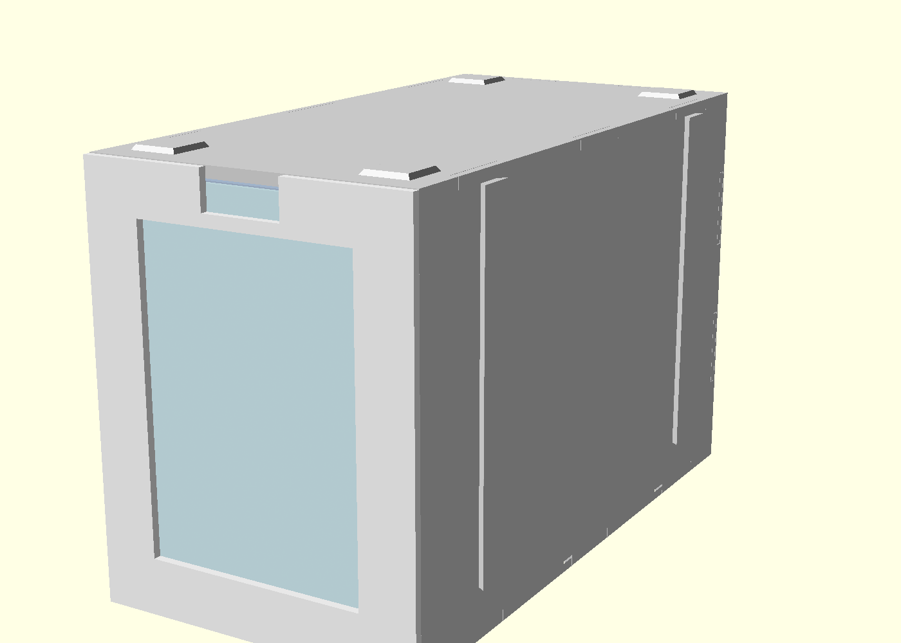
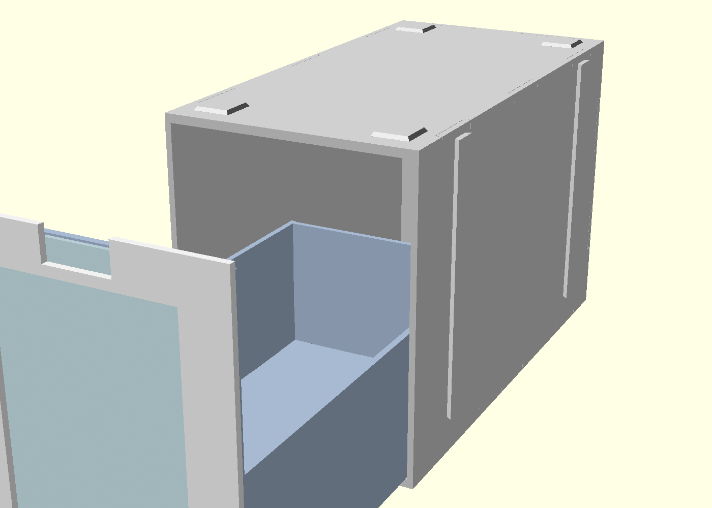

# ポケモンカード引き出し箱(Bambu Lab A1 mini 用)

カードを縦に収納する引き出し式ケースです。全部品が A1 mini の
造形範囲(180×180×180mm)に収まるように設計してあります。




## 特徴

- **全部品が平板**。ベッドに平置きで印刷するので、カードに触れる面は
  すべてビルドプレート面(=段差・積層痕なし)。組み立てはタブと
  スロットの摩擦圧入で、接着が要るのは前面フレーム1箇所だけ。
  板単位で壊れた部品だけ刷り直し・廃棄できます。
- **表紙カードポケット**。引き出し前面にカードを1枚差し込めて、
  透明PETGの窓板がカードを保護します。中身の概要が一目で分かります。
- **縦スタック**。天板の凸ノブが上の箱の底の凹みに嵌まります。
- **横連結**。側面の縦レールに、隣の箱とまたがるクリップを上から
  差し込んで連結します。2列×2〜3段の壁のように組めます。
- ダブルスリーブ(約70×95mm)まで入る内寸。素札なら約400枚、
  スリーブ入りで約200〜300枚(列長150mm)。

## 材料

| 材料 | 用途 |
|---|---|
| PLA(白) | 窓板以外の全部品 |
| PETG(透明) | 窓板 `window_pane` のみ |

## 部品表(1箱あたり)

| 部品 | 数量 | 印刷の向き |
|---|---|---|
| `drawer_bottom` | 1 | そのまま(カード面がベッド側) |
| `drawer_side_left` / `right` | 各1 | そのまま(カード面がベッド側) |
| `drawer_back` | 1 | そのまま |
| `drawer_front_inner` | 1 | そのまま |
| `drawer_front_frame` | 1 | 化粧面をベッド側、リブが上 |
| `window_pane` (PETG) | 1 | 平置き |
| `case_bottom` / `case_top` | 各1 | そのまま(引き出しが滑る面がベッド側) |
| `case_side_left` / `right` | 各1 | そのまま(レールが上) |
| `case_back` | 1 | 平置き |
| `clip`(連結クリップ) | 連結1箇所につき2 | 平置き |
| `follower`(カード倒れ防止) | 任意で1 | 平置き |

材料はおよそ1箱310g(引き出し約110g+外箱約200g)。0.2mm積層で
合計10時間前後が目安です(正確な時間はスライサーで確認してください)。
どの部品も1枚2〜3時間以下なので、失敗しても被害が小さいです。

## 印刷設定

- ノズル0.4mm / 積層0.2mm / 壁3周 / インフィル15%(平板なのでほぼ壁)
- **エレファントフット補正を有効に**(Bambu Studio 既定の0.075mmでOK)。
  タブの一層目が太るとスロットに入らなくなります。
- サポート不要。ブリム不要(細長い部品なので気になるなら側板だけブリム)。
- 窓板(PETG)は透明度を上げるなら 100%インフィル・単色・ゆっくり。
  多少曇っても中のカードは見えます。

## まず嵌め合いテスト

`coupon_slot` と `coupon_tab`(数分で印刷可)を刷って、タブが
手で押し込んでしっかり止まるか確認してください。緩い/きつい場合は
`card_drawer.scad` の `fit`(既定0.15mm)を±0.05ずつ調整して
STLを作り直します。連結を使うなら `coupon_rail` を2枚刷り、
レール同士を向かい合わせて `clip` を差して確認します。

## 組み立て

引き出し(タブはすべて `drawer_bottom` のスロットに上から差し込む):

1. 左右の側板を底板に差す(スロット位置が後ろ寄りの端が背面側)。
2. 背板を差す。側面のタブが側板のスロットに入ります。
3. `drawer_front_inner`(背の高い前板)を前端のスロットに差す。
4. `drawer_front_frame` のリブ面に接着剤(瞬間接着剤で可)を塗り、
   前板の前面に貼り合わせる。窓が下端寄り、指かけの切り欠きが上。

外箱:

1. 左右の側板のタブを `case_bottom` に差す(レールは外向き、
   背面スロットのある端が後ろ)。
2. `case_back` を差す。
3. `case_top` を上から被せてタブを全部通す(ノブが上面)。

きつければ当て木をしてゴムハンマーで軽く叩き、緩ければタブの根元に
一滴だけ接着してください。

## 使い方

- **表紙カード**: 引き出しを引き出してから、前面の隙間に上から
  透明窓板→カードの順に差し込みます(カードが窓板の後ろ)。
  上端の切り欠きから指でつまんで交換できます。少し引き出しを
  前に傾けると入れやすいです。
- **スタック**: ノブを下の箱の凹みに合わせて載せるだけ。
  **縦積みは2段まで**を推奨。3段以上にするときは必ず横連結して
  壁状(例: 2列×3段)にしてください。
- **横連結**: 箱を横に並べる(レール同士が向き合い、間隔約3.6mm)。
  前後2本のレール対それぞれに `clip` を上から差し込みます。
  上に箱を載せる前に差してください。
- **半開き**: 摩擦だけで任意の位置で止まります。前半分だけ見るときは
  半分引き出せば前寄りのカードが上から見えます。全部見るときは
  そのまま抜き切って手に持てます。
- **follower**: カードが少ないときに列の後ろに入れて倒れを防ぎます
  (足をカードと反対側に向ける)。側面や底に刻みを付けない代わりの
  仕切りです。

## 寸法とカスタマイズ

主要パラメータは `card_drawer.scad` の先頭にあります:

- `pocket_w = 74` — 引き出し内幅。ダブルスリーブ(〜70mm)+指の余裕
- `card_space = 96` — 床上の高さ。ダブルスリーブ(〜95mm)+遊び
- `row_len = 150.5` — カード列の長さ(容量)。短くすれば印刷も速い
- `fit = 0.15` — タブとスロットの片側クリアランス
- `slide = 0.5` — 引き出しと外箱の片側クリアランス

外形は約 幅83 × 奥行161(フレーム込み) × 高さ104.6mm。
変更後の STL は `make`(要 [OpenSCAD](https://openscad.org/))で
`stl/` に一括生成されます。単品なら:

```sh
openscad -o stl/drawer_bottom.stl -D 'part="drawer_bottom"' card_drawer.scad
```
